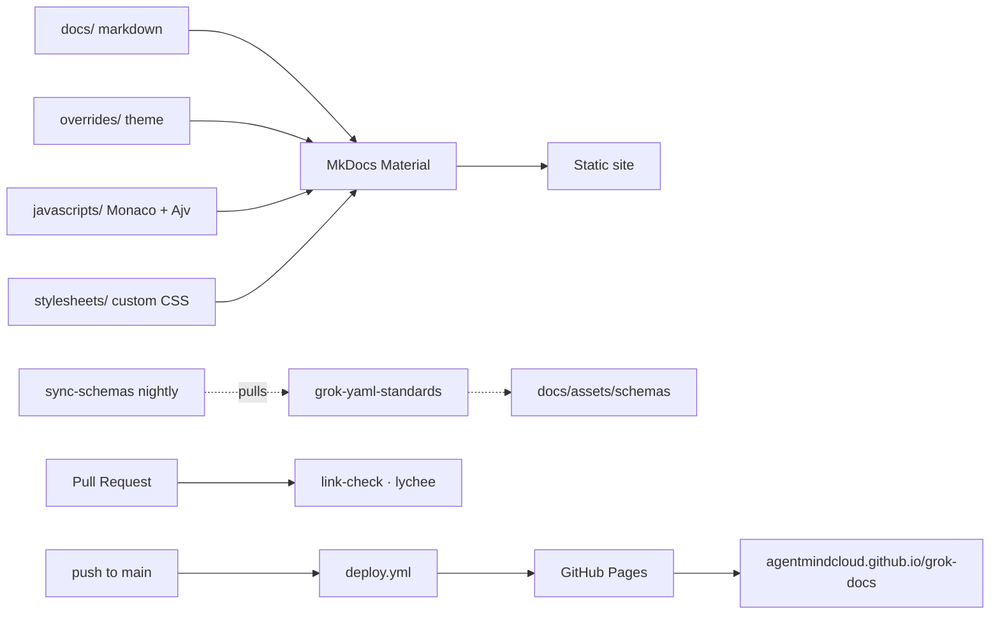

<!-- NEON / CYBERPUNK REPO TEMPLATE · GROK-DOCS -->

<p align="center">
  
</p>

<h1 align="center">⚡ grok-docs</h1>

<p align="center">
  <b>Every spec, guide, tutorial, and playground for the <code>grok-install</code> ecosystem.</b><br/>
  YAML reference · CLI reference · 10-minute tutorial · live validator · template gallery.
</p>

<p align="center">
  
</p>

<p align="center">
  <a href="https://agentmindcloud.github.io/grok-docs/"></a>
  
  
  
  <a href="./LICENSE"></a>
</p>

<p align="center">
  <a href="https://agentmindcloud.github.io/grok-docs/"><b>🌐 Visit the Live Site →</b></a>
</p>

---

## ✦ What's Here

<table>
  <tr>
    <td width="33%">
      <h3>📖 Full Spec Reference</h3>
      <p>YAML reference for v2.12 across all five file types — exhaustive, versioned, schema-linked.</p>
    </td>
    <td width="33%">
      <h3>⏱️ 10-Minute Tutorial</h3>
      <p>From zero to a running Grok agent in ten minutes. Copy-paste-run, no filler.</p>
    </td>
    <td width="33%">
      <h3>⚙️ CLI Reference</h3>
      <p>Every <code>grok-install</code> subcommand, every flag, every exit code.</p>
    </td>
  </tr>
  <tr>
    <td>
      <h3>🧪 Live Playground</h3>
      <p>Client-side YAML validator. Monaco editor + Ajv in the browser — no backend, no rate limits.</p>
    </td>
    <td>
      <h3>🎭 Orchestration Guides</h3>
      <p>Multi-agent deep-dives: swarm, debate, hierarchical, parallel tools, recovery patterns.</p>
    </td>
    <td>
      <h3>🖼️ Template Gallery</h3>
      <p>Single-agent · multi-step · swarm. Every template deep-linked to <code>awesome-grok-agents</code>.</p>
    </td>
  </tr>
  <tr>
    <td>
      <h3>🔌 Ecosystem Notes</h3>
      <p>How <code>grok-install</code> composes with xAI SDK, LiteLLM, and Semantic Kernel.</p>
    </td>
    <td>
      <h3>🏢 For xAI</h3>
      <p>The adoption pitch — why an official community spec is good for the model and the platform.</p>
    </td>
    <td>
      <h3>📐 Live Schemas</h3>
      <p>JSON Schemas synced nightly from <code>grok-yaml-standards</code> — always fresh.</p>
    </td>
  </tr>
</table>

## ✦ Build Locally

```bash
pip install -r requirements.txt
mkdocs serve
```

Visit [http://localhost:8000](http://localhost:8000). Hot reload on save.

## ✦ How It's Built



## ✦ Repo Structure

```
.
├── mkdocs.yml                    # MkDocs Material config
├── requirements.txt              # Pinned Python deps
├── overrides/                    # Theme overrides
├── docs/                         # All content
│   ├── index.md                  # Landing page
│   ├── getting-started/          # Install, first agent, deploy
│   ├── spec/                     # Five YAML file references
│   ├── guides/                   # Topical deep-dives
│   ├── cli/                      # CLI reference
│   ├── gallery/                  # Template gallery (single-agent, multi-step, swarm)
│   ├── playground/               # Live YAML validator (Monaco + Ajv)
│   ├── ecosystem/                # xAI SDK, LiteLLM, Semantic Kernel
│   ├── for-xai/                  # Adoption guide
│   ├── assets/                   # Logo, favicon, schemas
│   ├── stylesheets/              # Custom CSS
│   └── javascripts/              # Terminal demo + playground
└── .github/workflows/
    ├── deploy.yml                # Build + deploy to GitHub Pages on push to main
    ├── link-check.yml            # lychee link checker on PRs
    └── sync-schemas.yml          # Nightly sync from grok-yaml-standards
```

## ✦ CI Workflows

<table>
  <tr>
    <td width="33%">
      <h3>🚀 deploy.yml</h3>
      <p>Builds the site and publishes to GitHub Pages on every push to <code>main</code>. Live within ~90 seconds of merge.</p>
    </td>
    <td width="33%">
      <h3>🔗 link-check.yml</h3>
      <p><code>lychee</code> link checker runs on every PR. No broken links merge.</p>
    </td>
    <td width="33%">
      <h3>🔄 sync-schemas.yml</h3>
      <p>Nightly pull from <code>grok-yaml-standards</code> keeps <code>docs/assets/schemas/</code> current without manual PRs.</p>
    </td>
  </tr>
</table>

## ✦ Sibling Repos

<table>
  <tr>
    <td width="33%">
      <h3>📦 grok-install</h3>
      <p>The universal spec this documentation describes.</p>
      <a href="https://github.com/agentmindcloud/grok-install">Repository →</a>
    </td>
    <td width="33%">
      <h3>⚙️ grok-install-cli</h3>
      <p>The CLI this documentation references.</p>
      <a href="https://github.com/agentmindcloud/grok-install-cli">Repository →</a>
    </td>
    <td width="33%">
      <h3>📐 grok-yaml-standards</h3>
      <p>The schema registry this site syncs nightly.</p>
      <a href="https://github.com/agentmindcloud/grok-yaml-standards">Repository →</a>
    </td>
  </tr>
  <tr>
    <td>
      <h3>🌟 awesome-grok-agents</h3>
      <p>The template gallery this site indexes.</p>
      <a href="https://github.com/agentmindcloud/awesome-grok-agents">Repository →</a>
    </td>
    <td>
      <h3>🛒 grok-agents-marketplace</h3>
      <p>The live marketplace at <a href="https://grokagents.dev">grokagents.dev</a>.</p>
      <a href="https://github.com/agentmindcloud/grok-agents-marketplace">Repository →</a>
    </td>
    <td>
      <h3>🎭 grok-agent-orchestra</h3>
      <p>Multi-agent runtime featured in the orchestration guides.</p>
      <a href="https://github.com/agentmindcloud/grok-agent-orchestra">Repository →</a>
    </td>
  </tr>
</table>

## ✦ Contributing

See [Contributing](./docs/contributing.md). Typo fixes, missing examples, better guides — all welcome. Every PR runs the link checker, so please don't link to anything that doesn't exist yet.

## ✦ Connect

<p align="center">
  <a href="https://agentmindcloud.github.io/grok-docs/"></a>
  <a href="https://github.com/agentmindcloud"></a>
  <a href="https://x.com/JanSol0s"></a>
  <a href="https://grokagents.dev"></a>
</p>

## ✦ License

Apache 2.0 — see [LICENSE](./LICENSE).

<p align="center">
  
</p>
